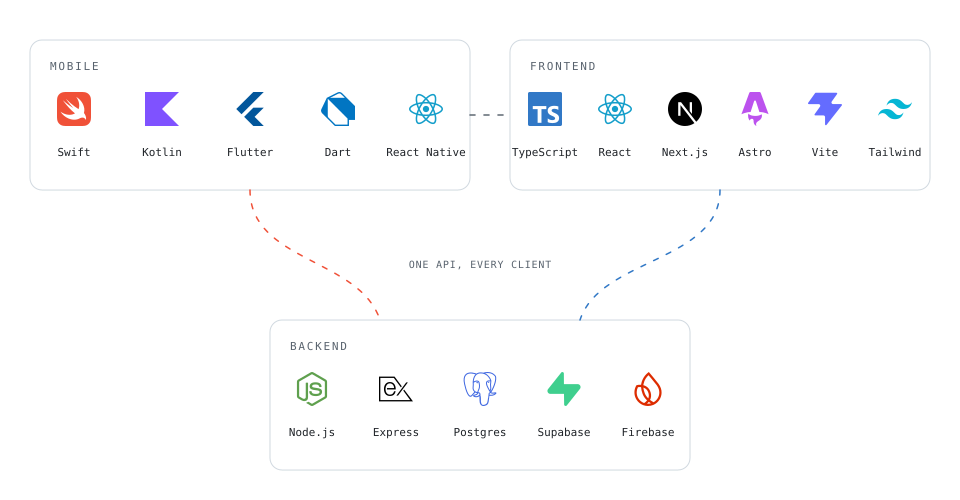
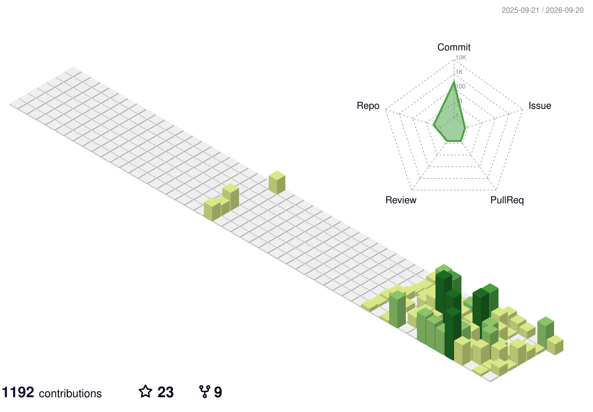

<h1 align="left" id="didik-title">Hi, I'm Didik 👋</h1>

  
  
  
  
  

  

<h3 align="left">Software Engineer building mobile and full-stack products</h3>

<a href="#didik-title">
  <picture>
    <source media="(prefers-color-scheme: dark)" srcset="./metrics/overview-dark.svg" />
    <source media="(prefers-color-scheme: light)" srcset="./metrics/overview.svg" />
    
  </picture>
</a>

### About Me

- 🏗️ &nbsp;Building React Native apps for MAS-regulated renovation escrow payments at **[HomePay]** Singapore
- 📱 &nbsp;Deep mobile engineering backed by full-stack **TypeScript**, **Node.js**, and database delivery
- ✍️ &nbsp;Writing on **[Medium]** and publishing technical work at **[didikmaulana.com]**

 

<h2 align="center" id="didik-tech">Tech Stack</h2>

  <picture>
    <source media="(prefers-color-scheme: dark)" srcset="./assets/stack-dark.svg" />
    <source media="(prefers-color-scheme: light)" srcset="./assets/stack-light.svg" />
    
  </picture>

<h2 align="center">Recent Contributions</h2>

  <picture>
    <source media="(prefers-color-scheme: dark)" srcset="https://streak-stats.demolab.com?user=didik-maulana&hide_border=true&date_format=j%20M%5B%20Y%5D&theme=transparent&ring=0175C2&fire=F05138&currStreakLabel=58A6FF&sideLabels=C9D1D9&currStreakNum=C9D1D9&sideNums=C9D1D9&dates=8B949E" />
    <source media="(prefers-color-scheme: light)" srcset="https://streak-stats.demolab.com?user=didik-maulana&hide_border=true&date_format=j%20M%5B%20Y%5D&theme=transparent&ring=0175C2&fire=F05138&currStreakLabel=0969DA&sideLabels=24292F&currStreakNum=24292F&sideNums=24292F&dates=57606A" />
    
  </picture>

  

  <picture>
    <source media="(prefers-color-scheme: dark)" srcset="./profile-3d-contrib/profile-night-green.svg" />
    <source media="(prefers-color-scheme: light)" srcset="./profile-3d-contrib/profile-green-animate.svg" />
    
  </picture>

<h2 align="center">Get in Touch</h2>

Open to senior mobile and full-stack engineering roles. Reach out if you need someone to ship reliable apps and the full-stack systems behind them.

  
  &nbsp;&nbsp;
  
  &nbsp;&nbsp;
  

<!-- links -->

[HomePay]: https://www.linkedin.com/company/homepaysg "HomePay"
[Medium]: https://medium.com/@didik.ardiansyah "Medium"
[didikmaulana.com]: https://didikmaulana.com "Portfolio and resume"
